<p>
  <h1 align="center"><b>Hello there, I'm Saiprasad Toshatwad </b></h1>
</p>

<div id="header" align="center">
  
</div>

<div id="badges" align="center">
  <a href="https://www.linkedin.com/in/saiprasad-toshatwad-a75449206/">
    
  </a>
</div>

### 👨‍💻: About Me :
#### I am a Data Scientist and Backend engineer.

- :telescope: I’m a Data Scientist and working on ML/DL models and backend for building Machine learning  applications.
- 🥅 2024 Goals: To become a Full Stack Data Scientist , MLOps and LLMOps Pro
- :zap: In my free time, I read tech articles on medium and watch anime.
- 📬 How to reach me: saiprasadtoshatwad@gmail.com

### :hammer_and_wrench: Tech Stack:

#### Programming Lanugages
- Python
- Go
- Rust

```mermaid
gantt
    title Command over programming knowledge
    dateFormat  X
    axisFormat %s

    section Python
    10   : 0, 10
    section Golang
    9   : 0, 9
    section Rust
    1   : 0, 1
```



```javascript
(function(element) {
    require(['d3'], function(d3) {
        // Set up margins and dimensions for the chart
        const margin = {top: 60, right: 60, bottom: 70, left: 90},
              width = 960 - margin.left - margin.right,
              height = 400 - margin.top - margin.bottom;
        
        // Create SVG element
        const svg = d3.select(element.get(0))
              .append("svg")
              .attr("width", width + margin.left + margin.right)
              .attr("height", height + margin.top + margin.bottom)
              .append("g")
              .attr("transform", `translate(${margin.left},${margin.top})`);
        
        // Data for the chart
        const data = [{'X': 'United States', 'Y': 12394},
                      {'X': 'Russia', 'Y': 6148},
                      {'X': 'Germany (FRG)', 'Y': 1653},
                      {'X': 'France', 'Y': 2162},
                      {'X': 'United Kingdom', 'Y': 1214},
                      {'X': 'China', 'Y': 1131},
                      {'X': 'Spain', 'Y': 814},
                      {'X': 'Netherlands', 'Y': 1167},
                      {'X': 'Italy', 'Y': 660},
                      {'X': 'Israel', 'Y': 1263}];

        // Create x scale
        const x = d3.scaleLinear()
            .domain([0, d3.extent(data, function(d) { return d.Y })[1]])
            .range([ 0, width]);

        // Append x axis to the svg
        svg.append("g")
                .attr("transform", `translate(0, ${height})`)
                .call(d3.axisBottom(x))
                .selectAll("text")
                .attr("transform", "translate(-10,0)rotate(-45)")
                .style("text-anchor", "end");
        
        // Create y scale
        const y = d3.scaleBand()
            .range([ 0, height ])
            .domain(data.map(d => d.X))
            .padding(.1);
        
        // Append y axis to the svg
        svg.append("g")
                .call(d3.axisLeft(y))
        
        // Create rectangles for the bars
        svg.selectAll("Rectangle")
                .data(data)
                .join("rect")
                .attr("x", x(0) )
                .attr("y", d => y(d.X))
                .attr("width", d => x(d.Y))
                .attr("height", y.bandwidth())
                .attr("fill", "skyblue");
    })
})(element);
```


#### Data Science Stack
- Python, Data visualization, Supervised Learning algo, Unsupervised Learning algos, ANN, EDA, feature enginnering, feature selection & extraction,
Scikit-Learn, Tensorflow, Xgboost, Numpy , Pandas, Scipy, Beautiful Soup, Flask, Fastapi, .. etc

#### Devops/Mlops
- Linux,  [DVC](https://dvc.org/), [Mlflow](https://mlflow.org/), CI/CD, Jenkins, Docker, Kubernetes,  AWS, S3, EC2, lambda, boto3, [kedro](https://kedro.org/), 
- Go, Raspberry pi

#### Python Packges , Frameworks and Databases
- Scikit-Learn, Tensorflow, Xgboost, Numpy , Pandas, Scipy, Beautiful Soup, Flask, Fastapi
- Mysql, Postgresql

#### BI Tools
- PowerBI,  Tableau

# 📊 GitHub Stats:
<br/>

---

## 🏆 GitHub Trophies


---

